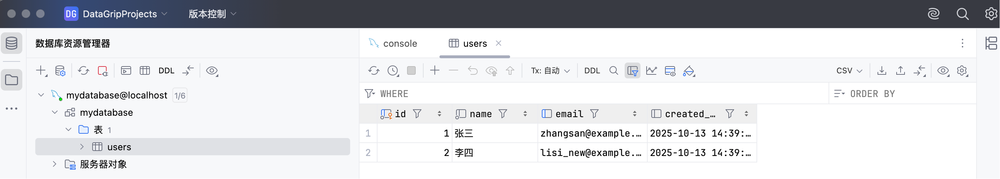

# (X)-LRⅡ招新-数据与存储与网络爬虫

# Part2-数据库与数据储存

## Task0-阅读资料

### 1.我们为什么需要数据库？

 数据库的主要作用就是便利我们对数据的操作，假想我们把一推数据放在csv或者excel中，我们对与数据的操作是受限的。举个例子，我们还可以在excel中找到1条名字（搜索），但我们如果要提取某个数据>100的所有行，这在excel中是不可能实现的，但对于数据库，我们只需要输入命令行即可实现。

### 2.你认为像 DataGrip 这样的专业数据库 IDE 主要能带来哪些效率上的提升？

虽然mysql是可用的，但在命令行中操作有诸多弊端。一是在终端上写代码不是十分直观，对于较少行的数据，使用select*from 还可以较直观的输出表格，但如果表的行数十分多时，它会折叠多行，这样的显示就不直观了。第二个原因是在命令行中写代码比较容易写错。如果写错，只能重来，故其的效率较低。

### 3.我们如何在scrapy中配置数据库的连接？

我们需要在其中使用pipe管道，这个在下面的程序中会写出，这里我们就不详述了

## Task1-环境配置

### 截图：

## Task2-将种子存储到数据库

### 问题解答：

主要原因是这样可以使文件与数据库记录紧密绑定，不会出现文件丢失或路径错误。这样我们更可以将数据库更好的传递给他人。

### 解答过程：

这道题我是真的服了，确实做的比较恶心（^_^），只要是我一开始我的想法是寻找特征来用**“?P<>.*?”**的形式来提取，但是观察并尝试后就被背刺了，他的各种番组名的连接并不规范，有的是-来区分名字和信息，但有的番剧名内部就含有-，所以这样的提取经常会失败，同时有的中括号是“[”，有的是“【”,有的又什么都没有，则就导致了有时前几个都运行正常，但一开始遍历就死了。后来在学长的提示（拷打）下，我发现与其依靠括号等提示词来获取数据，有很多方向（如视频编码等的可能性只有几个，故我们直接尝试提取这几个值），对于标题，其实我的方法就是尽可能的穷尽所有的可能，但其实我在title上的提取并不是很好。

### 项目运行截图:

## Task3-完善金融数据的爬取

### 问题以及解决方案

这道题困扰我的主要问题就是如何获取那两个状态，我们从part1中获得的原网页的text如下：

但经过我的仔细寻找，我还是找不到任何关于开放赎回等信息，甚至在原网页上也没有，但后来我只好将一直股票打开，此时我们发现在详情页上就有这个信息。

同时我们注意到，子页面的代码的数字（特征）就是基金的code，所以此时我们检查网页的源代码，

使用既然在，我们就直接用xpath提取即可。故这个任务结束了

但由于此时我们要访问子页面，所以爬去的速度会下降，而且我我是再是害怕再被封ip了，所以我在setting中加入了随机延迟。

### 代码运行截图

